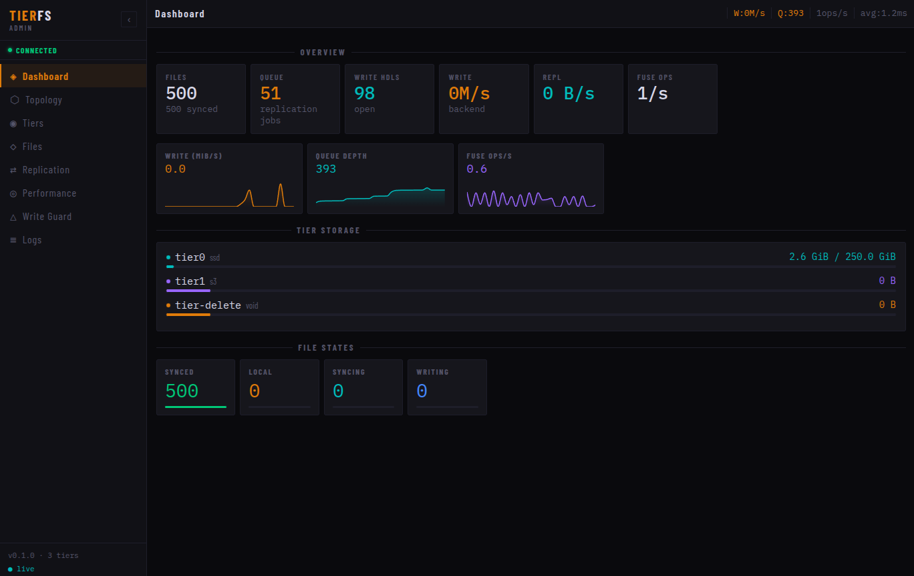

# TierFS

_Transparent N-tier FUSE storage for media-heavy workloads._

[](https://go.dev)
[](LICENSE)
[](https://goreportcard.com/report/github.com/mikey-austin/tierfs)
[](https://pkg.go.dev/github.com/mikey-austin/tierfs)

TierFS is a FUSE daemon that presents a single unified filesystem path to applications while transparently tiering file data across any number of storage backends — local SSD, NAS over NFS, SFTP, SMB/CIFS shares, and S3-compatible object storage (MinIO, Ceph RGW, Backblaze B2). Files are written to the fastest tier and migrated to slower, cheaper storage automatically according to age-based rules and capacity pressure, with digest-verified copies ensuring data integrity throughout.

It was built for surveillance and media workloads where data arrives at high volume, must be immediately accessible, but has a known access cliff — Frigate NVR clips are replayed in the first 48 hours and rarely touched again. TierFS makes that operational reality a configuration option, not an application concern. Any process that can write files works with TierFS without modification.

## Features

| Feature                        | Detail                                                                                          |
|--------------------------------|-------------------------------------------------------------------------------------------------|
| **Transparent FUSE mount**     | Applications see a single path; all tiering is invisible                                        |
| **N-tier policy engine**       | Unlimited tiers with per-rule TOML eviction schedules                                           |
| **5 backend types**            | `file://` (local/NFS), `s3://` (MinIO, Ceph, AWS, B2), `sftp://`, `smb://`, `null://` (discard) |
| **Transform pipeline**         | Pluggable compression (gzip, zstd) and AES-256-GCM encryption; ordering enforced automatically  |
| **Digest verification**        | xxhash3-128 (>30 GB/s with SIMD) confirms copy integrity                                        |
| **Async replication**          | Configurable worker pool with retry and write-quiescence guard; writes never block              |
| **Capacity pressure eviction** | Threshold/headroom watermarks trigger oldest-first eviction                                     |
| **Promote on read**            | Cold files pulled back to hot tier transparently on access                                      |
| **Pin tier**                   | Named files or directories exempted from auto-eviction                                          |
| **Write guard**                | Configurable quiescence window prevents replication of in-progress multi-phase writes           |
| **Structured observability**   | 22 Prometheus metrics, OpenTelemetry tracing, zap JSON logs with rotation                       |
| **Admin UI**                   | React SPA for monitoring tier status, replication, and eviction activity                        |
| **Hexagonal architecture**     | Domain ports; adapters injected at startup; fully testable                                      |



## How It Works

```
┌─────────────────────────────────────────────────┐
│  Application (Frigate, Immich, ffmpeg, ...)      │
│  writes/reads /share/CCTV                        │
└──────────────────────┬──────────────────────────┘
                       │ FUSE syscalls
┌──────────────────────▼──────────────────────────┐
│  TierFS FUSE layer  (hanwen/go-fuse/v2)          │
│  pathfs.FileSystem -> TierService                │
└────────┬──────────────────────┬─────────────────┘
         │ writes               │ reads
    ┌────▼────┐            ┌────▼────┐
    │  tier0  │            │ LocalPath│ (zero-copy fd)
    │  SSD    │            │ or stage │ (remote: copy to /tmp)
    └────┬────┘            └─────────┘
         │ async replication (Replicator worker pool)
    ┌────▼────┐    ┌────────┐    ┌──────────┐    ┌────────┐
    │  tier1  │    │  tier2 │    │  tier3   │    │ tier4  │
    │NAS/SFTP │    │ MinIO  │    │ Backblaze│    │ null://│
    │  /SMB   │    │        │    │          │    │(discard)│
    └─────────┘    └────────┘    └──────────┘    └────────┘
         ▲
    Evictor loop (age schedule + capacity pressure)
    deletes from hot tier once cold copy is verified
```

- **Writes** always land on the hottest tier (priority 0) and are enqueued for async replication.
- **Reads** are served from the lowest-priority tier that has a verified local copy; remote-only files are staged to a local temp directory transparently.
- **Eviction** removes files from a tier once the next tier has a digest-verified copy and the configured `after` age has elapsed.

## Supported Backends

| Scheme | Implementation | Notes |
|---|---|---|
| `file://` | Local/NFS filesystem | Atomic writes, zero-copy FUSE reads via `LocalPath`, empty-dir pruning |
| `s3://` | AWS SDK v2 | MinIO, Ceph RGW, Backblaze B2 via `endpoint` + `path_style`; multipart upload for large files |
| `sftp://` | `pkg/sftp` over `x/crypto/ssh` | SSH agent, key file, or password auth; auto-reconnect; atomic temp-file writes |
| `smb://` | `go-smb2` (pure Go) | SMB2/3; NTLM auth; auto-reconnect on transport errors; atomic rename |
| `null://` | Stateless discard | Terminal tier; implements `Finalizer` to purge metadata on eviction |

## Quick Start

### Docker Compose (with Frigate NVR)

```yaml
# docker-compose.yml
services:
  tierfs:
    image: ghcr.io/mikey-austin/tierfs:latest
    cap_add: [SYS_ADMIN]
    devices: [/dev/fuse]
    security_opt: [apparmor:unconfined]
    volumes:
      - ./tierfs.toml:/etc/tierfs/tierfs.toml:ro
      - /mnt/ssd/cctv:/data/tier0          # hot tier: local SSD
      - /mnt/nas/cctv:/data/tier1           # warm tier: NAS via NFS
      - tierfs-meta:/var/lib/tierfs
      - /share/CCTV:/share/CCTV:shared      # FUSE mount point
    ports: ["9100:9100"]

  frigate:
    image: ghcr.io/blakeblackshear/frigate:stable
    volumes:
      - /share/CCTV:/media/frigate          # same mount point
    depends_on: [tierfs]
```

```toml
# tierfs.toml — minimal 2-tier config
[mount]
path    = "/share/CCTV"
meta_db = "/var/lib/tierfs/meta.db"

[replication]
workers = 4
verify  = "digest"

[eviction]
check_interval     = "5m"
capacity_threshold = 0.85
capacity_headroom  = 0.70

[[backend]]
name = "ssd"
uri  = "file:///data/tier0"

[[backend]]
name = "nas"
uri  = "file:///data/tier1"

[[tier]]
name     = "tier0"
backend  = "ssd"
priority = 0
capacity = "500GiB"

[[tier]]
name     = "tier1"
backend  = "nas"
priority = 1
capacity = "8TiB"

[[rule]]
name            = "recordings"
match           = "recordings/**"
evict_schedule  = [{after = "24h", to = "tier1"}]
promote_on_read = false

[[rule]]
name  = "clips"
match = "clips/**"
evict_schedule  = [{after = "168h", to = "tier1"}]
promote_on_read = "tier0"

[[rule]]
name  = "default"
match = "**"
evict_schedule = [{after = "48h", to = "tier1"}]
```

## Installation

### From Source

```bash
git clone https://github.com/mikey-austin/tierfs.git
cd tierfs
go mod download
make build        # -> bin/tierfs
```

Requires Go 1.26+, `gcc` (for CGO/SQLite), and `libfuse3-dev` on Linux.

### Docker

```bash
docker pull ghcr.io/mikey-austin/tierfs:latest
```

### Pre-built Binary

Download from [GitHub Releases](https://github.com/mikey-austin/tierfs/releases/latest). Binaries are provided for `linux/amd64` and `linux/arm64`.

```bash
curl -Lo tierfs https://github.com/mikey-austin/tierfs/releases/latest/download/tierfs-linux-amd64
chmod +x tierfs
sudo mv tierfs /usr/local/bin/
```

## Running

```bash
# Copy and edit the example config
cp tierfs.example.toml /etc/tierfs/tierfs.toml

# Run the daemon
./bin/tierfs -config /etc/tierfs/tierfs.toml
```

### Docker

```bash
docker run --cap-add SYS_ADMIN --device /dev/fuse \
  -v /etc/tierfs/tierfs.toml:/etc/tierfs/tierfs.toml:ro \
  -v /share/CCTV:/share/CCTV:shared \
  -p 9100:9100 tierfs
```

## Configuration

TierFS is configured entirely via a TOML file. The core pattern is one `[[backend]]` block per storage target, one `[[tier]]` block per tier, and `[[rule]]` blocks that map file path globs to eviction schedules:

```toml
[[tier]]
name     = "tier0"
backend  = "ssd"
priority = 0
capacity = "500GiB"

[[rule]]
name           = "recordings"
match          = "recordings/**"
evict_schedule = [{after = "24h", to = "tier1"}]
```

Rules are evaluated in declaration order; the first match wins. A catch-all `match = "**"` rule at the end is required.

### Backend-Specific Configuration

**S3** — set `endpoint` and `path_style = true` for MinIO/Ceph. Credentials via `AWS_ACCESS_KEY_ID`/`AWS_SECRET_ACCESS_KEY` environment variables.

**SFTP** — authentication tries SSH agent, then key file (`TIERFS_SFTP_KEY_PATH` env or `~/.ssh/id_ed25519`), then password (`TIERFS_SFTP_PASS` env). Set `sftp_host_key` for host key verification in production (use `ssh-keyscan`).

**SMB** — credentials via `TIERFS_SMB_USER`/`TIERFS_SMB_PASS` environment variables, config fields, or URI userinfo (in that priority order).

**Transforms** — add a `[transform]` section to any backend for compression and/or encryption:

```toml
[[backend]]
name = "encrypted-nas"
uri  = "file:///mnt/nas/CCTV"

[backend.transform]
compression = "zstd"                    # "gzip" or "zstd"
encryption_key = "base64-encoded-key"   # AES-256-GCM
```

Compression is always applied before encryption regardless of config order. See [tierfs.example.toml](tierfs.example.toml) for a full reference config.

## Admin UI

A React-based admin dashboard is included for monitoring tier status, replication progress, and eviction activity.

```bash
cd web/admin
npm install
npm run dev          # dev server on :3000
npm run build        # production build -> web/admin/dist/
```

Or via Make:

```bash
make ui              # npm install + npm run build
```

The UI currently uses simulated data. See `web/admin/README.md` for the API surface to implement for live data.

## Observability

TierFS exposes 22 Prometheus metrics at `:9100/metrics` across six subsystems: `backend`, `meta`, `replication`, `eviction`, `fuse`, and `tier`.

```promql
# Replication success rate
rate(tierfs_replication_jobs_total{outcome="ok"}[5m])
/ rate(tierfs_replication_jobs_total[5m])

# Queue backlog
tierfs_replication_queue_depth

# Hot tier fullness
tierfs_tier_bytes_used{tier="tier0"}
```

Health endpoint: `GET http://localhost:9100/healthz` -> `200 ok`

All log output is structured JSON via zap with automatic rotation via lumberjack:

```json
{"ts":"2026-03-13T19:32:43.123Z","level":"info","logger":"tier-service.replicator",
 "msg":"copying file","rel_path":"recordings/cam1/2026-03-13/12-00-00.mp4",
 "from":"file:///data/tier0/...","to":"s3://nvr-archive/...","attempt":1}
```

OpenTelemetry OTLP tracing is available for Jaeger, Grafana Tempo, etc. Enable via the `[observability.tracing]` config section.

See [docs/OPERATIONS.md](docs/OPERATIONS.md) for the full metrics reference, alerting rules, Grafana dashboard config, and troubleshooting runbook.

## Architecture

```
cmd/tierfs/main.go          Composition root; wires all adapters
        |
        | injects
   +----|----+----------------------------+
   |         |                            |
   v         v                            v
 fuse     app/TierService             observability/Stack
 adapter  app/Replicator              decorators wrapping
 (pathfs)  app/Evictor                all domain ports
           app/WriteGuard
        |
        | calls domain ports
   +----|----+-------------------+
   |                             |
   v                             v
 domain.Backend              domain.MetadataStore
 (interface / port)          (interface / port)
   |                             |
   v                             v
 adapters/storage/           adapters/meta/sqlite/
   file.Backend                sqlite.Store (WAL mode)
   s3.Backend
   sftp.Backend
   smb.Backend
   null.Backend
   transform.TransformBackend
```

The key rule: `internal/domain/` imports only Go stdlib. Nothing in domain knows about SQLite, FUSE, S3, SFTP, or SMB. All dependencies point inward.

See [ARCHITECTURE.md](ARCHITECTURE.md) for the complete system design, data flow diagrams, port interfaces, concurrency model, and design decisions.

## Development

```bash
make build           # compile bin/tierfs
make test            # unit + integration tests
make test-unit       # unit tests only with race detector
make bench           # run benchmarks
make lint            # golangci-lint
make fmt             # gofmt
make vet             # go vet
make ui              # build admin UI
make docker          # build Docker image
make clean           # remove build artifacts
```

## Use Cases

**Frigate NVR** — point Frigate at the TierFS mount. Recordings land on fast local SSD, replicate to NAS within minutes, and migrate to cold object storage after 30 days — all without any Frigate configuration beyond the media path.

**Immich** — keep the `upload/` directory on SSD for processing, tier generated thumbnails and encoded videos to NAS after a week, and move original RAW files to a pin-tier so they are never auto-evicted regardless of age.

**General media servers** — any workload where files are written once, accessed heavily for a short window, then infrequently. TierFS makes the cost/performance trade-off declarative and transparent.

## Contributing

Contributions are welcome — bug reports, documentation improvements, new storage backend adapters, and performance work are all valuable. Please read [CONTRIBUTING.md](CONTRIBUTING.md) for the development setup, the hexagonal architecture dependency rules, and the pull request checklist before opening a PR.

## License

MIT (c) 2026 mikey-austin — see [LICENSE](LICENSE).
